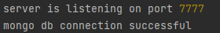
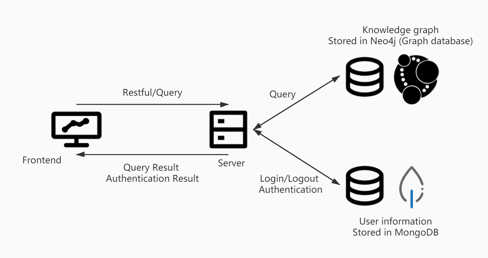

# cs510-project, 
## Description
This is the diretory for CS510 project, a Text Mining Knowledge Graph Visualizer to 
facilitate the experience of educational web with support of multi-user edition to build the graph better.

## Environment setup
To run this project, we need to run both frontend and backend.

#### Backend
First setup backend and keep the server running
```bash
cd frontend
npm install
node server.js
```
When succeeded, following message should be printed in the terminal


In case of Cloud mongoDB or Cloud Neo4j Database expired, it may fail

#### Frontend
```bash
cd backend
npm install
```
Next double click the index.html file to open it in a browser, you should be
able to navigate freely in this 510 knowledge graph


## Architecture
This project has two parts, frontend and backend
The workflow of the data transfer is shown as below.
